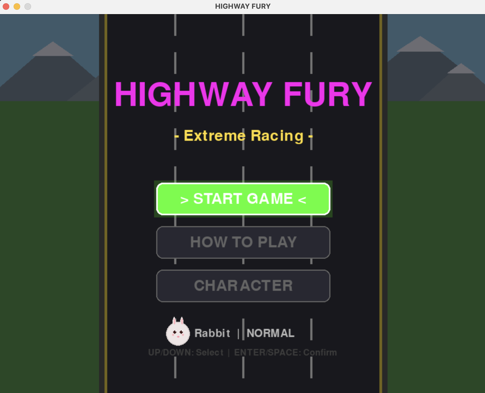
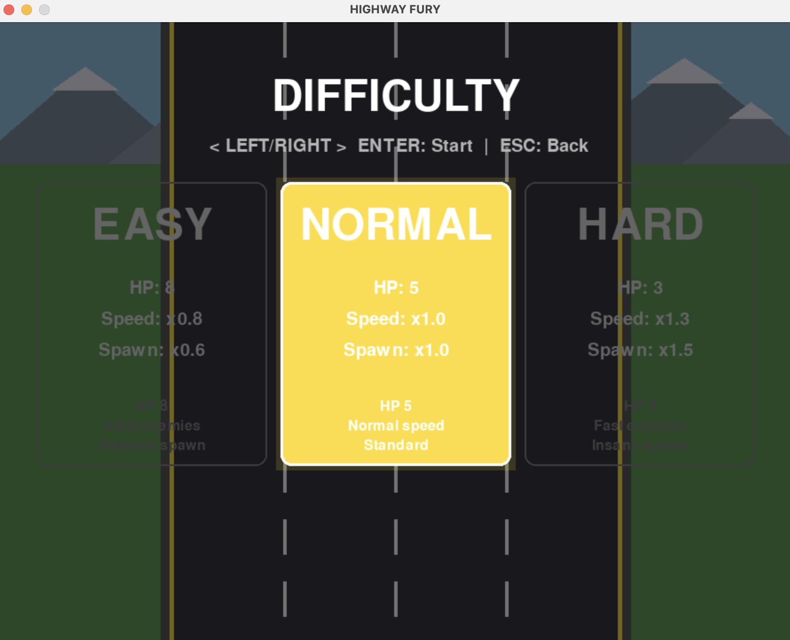
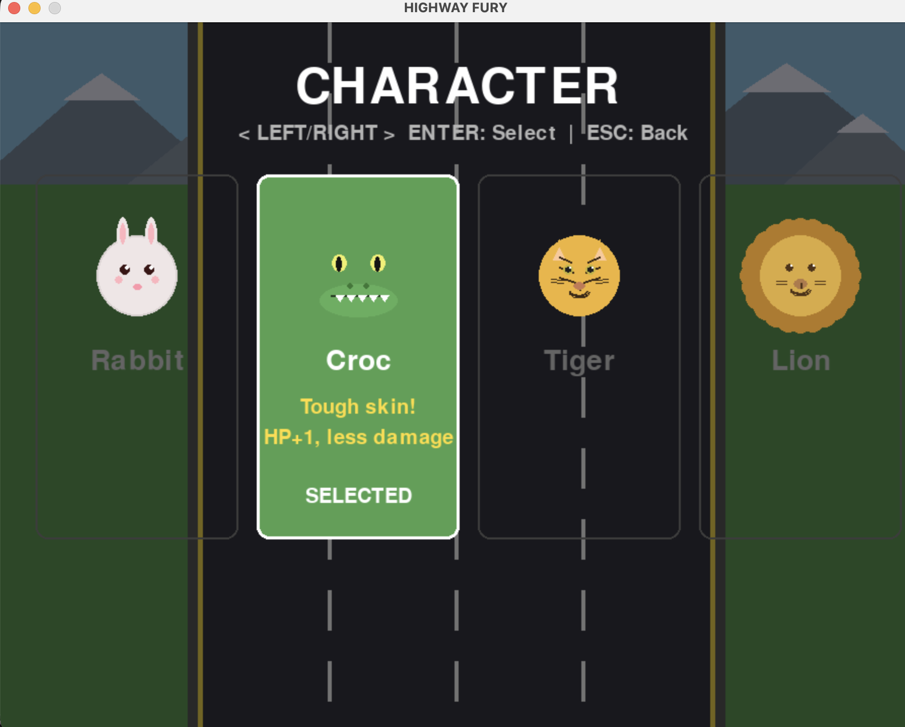
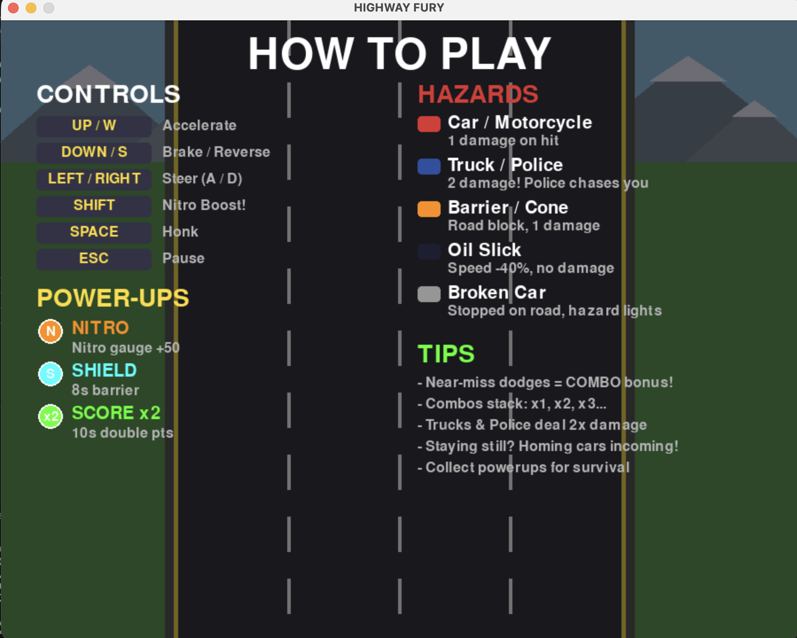
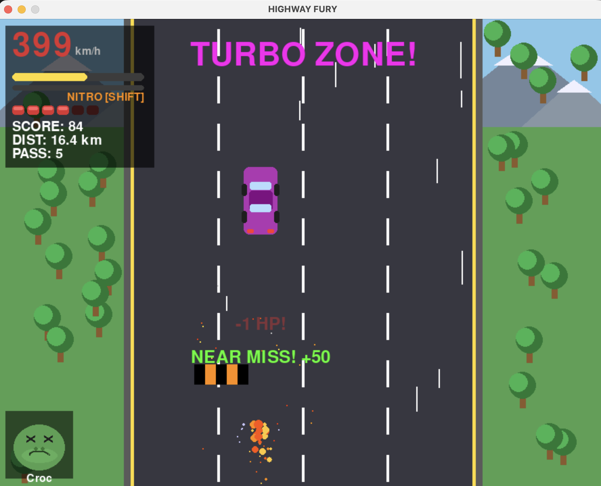
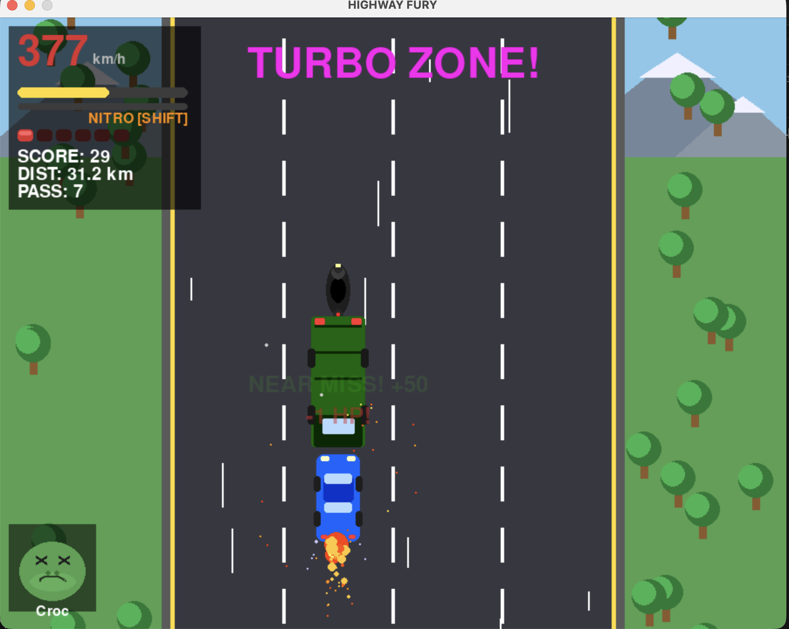

# Highway Fury

> Python과 Pygame만으로 만든 탑다운 고속도로 레이싱 게임
>
> **Cursor AI로 제작** - 대화형 AI 페어 프로그래밍을 통해 설계, 구현, 모듈화까지 진행



---

## 소개

Highway Fury는 끝없는 고속도로에서 차량을 피하고, 파워업을 수집하며, 최고 점수를 갱신하는 아케이드 스타일 드라이빙 게임입니다.

- 모든 시각 요소(자동차, 캐릭터 얼굴, 배경)는 **Pygame 기본 도형 함수로 프로시저럴하게** 그려집니다
- 모든 효과음은 **사인파 합성으로 런타임에 생성**됩니다
- 외부 이미지/사운드 파일을 **일절 사용하지 않습니다**

## 요구 사항

- Python 3.10+
- Pygame 2.x

## 설치 및 실행

```bash
pip install pygame              # 1. Pygame 설치
python -m highway_fury          # 2. 상위 디렉토리에서 실행
```

## 조작법

| 키 | 동작 |
|-----|--------|
| `UP` / `W` | 가속 |
| `DOWN` / `S` | 브레이크 |
| `LEFT` / `RIGHT` (`A`/`D`) | 좌우 조향 |
| `SHIFT` | 니트로 부스트 |
| `SPACE` | 경적 |
| `ESC` | 일시정지 / 뒤로가기 |

---

## 주요 기능

| 카테고리 | 내용 |
|----------|------|
| 캐릭터 | 토끼, 악어, 호랑이, 사자 4종 (고유 능력 + 표정 변화) |
| 난이도 | Easy / Normal / Hard (HP, 속도, 스폰 차등) |
| 장애물 8종 | 승용차, 트럭, 오토바이, 경찰차, 배리어, 콘, 오일, 고장 차량 |
| 파워업 3종 | 니트로 충전(N), 쉴드 배리어(S), 점수 2배(x2) |
| 콤보 시스템 | 아슬아슬하게 피할수록 콤보 적립, 보너스 점수 증가 |
| 시각 효과 | 화면 흔들림, 플래시, 슬로우모션, 파티클, 스피드라인 |
| 치즈 방지 AI | 차선 변경 AI, 플레이어 추적 경찰, 벽 패턴, 정지 감지 |
| 사운드 | 사인파 합성 기반 프로시저럴 효과음 (충돌, 경적, 부스트 등) |

### 난이도 스케일링

| 항목 | EASY | NORMAL | HARD |
|------|------|--------|------|
| HP | 8 | 5 | 3 |
| 적 속도 | x0.8 | x1.0 | x1.3 |
| 스폰 빈도 | x0.6 | x1.0 | x1.5 |
| 난이도 상승률 | 0.012/km | 0.020/km | 0.035/km |

### 캐릭터 능력

| 캐릭터 | 고유 능력 |
|--------|----------|
| **Rabbit** (토끼) | 조향 속도 540 (기본 450), 핸들링 최강 |
| **Croc** (악어) | 최대 HP +1, 트럭/경찰 충돌 시 데미지 1 감소 |
| **Tiger** (호랑이) | 니트로 최대속도 780 km/h, 니트로 소모 -25% |
| **Lion** (사자) | 콤보 보너스 2배, 콤보 수에 따라 점수 배율 증가 |

---

## 프로젝트 구조

```
highway_fury/
├── __init__.py          # 패키지 초기화
├── __main__.py          # 엔트리 포인트 (python -m highway_fury)
├── config.py            # 상수, 색상, 프리셋, 타입 정의
├── sounds.py            # 프로시저럴 사운드 생성 (SoundBank 클래스)
├── game.py              # Game 클래스: 상태 머신, 업데이트 루프, 스폰, 충돌 처리
│
├── drawing/             # 순수 렌더링 함수 (게임 상태 비의존)
│   ├── characters.py    # 4종 동물 얼굴 렌더러 (일반 + 피격 표정)
│   ├── vehicles.py      # 승용차, 트럭, 오토바이 차체 렌더링
│   └── scenery.py       # 배리어, 콘, 오일, 나무, 산 렌더링
│
├── entities/            # 게임 오브젝트 클래스 (상태 + 행동 + 렌더링)
│   ├── effects.py       # Particle, SpeedLine, FloatingText
│   ├── obstacle.py      # 차선 변경 AI 및 플레이어 추적 기능 포함
│   ├── powerup.py       # 수집형 파워업 아이템
│   └── player.py        # 캐릭터별 고유 능력치가 적용된 플레이어 차량
│
├── screens/             # UI 화면 렌더러 (게임 상태 읽기 전용)
│   ├── menu.py          # 메인 메뉴, 난이도 선택, 캐릭터 선택, 가이드 화면
│   ├── hud.py           # 인게임 HUD 및 캐릭터 초상화
│   └── overlays.py      # 게임 오버, 일시정지 오버레이
│
└── screenshots/         # 문서용 스크린샷
```

## 아키텍처

단방향 의존성을 가진 레이어 구조:

```
config (순수 데이터, 의존 없음)
  └── sounds (pygame.mixer 래핑)
  └── drawing/ (순수 드로잉 함수)
        └── entities/ (게임 오브젝트)
              └── screens/ (UI 렌더링)
                    └── game.py (오케스트레이터)
```

| 레이어 | 역할 | 의존 방향 |
|--------|------|-----------|
| `config` | 상수, 색상, 프리셋 (순수 Python) | 없음 |
| `sounds` | 사운드 생성/재생 래핑 | config |
| `drawing/` | 순수 그리기 함수 (상태 비의존) | config |
| `entities/` | 게임 오브젝트 (상태 + 렌더) | config, drawing |
| `screens/` | UI 화면 (게임 상태 읽기만) | config, drawing, entities |
| `game.py` | 전체 조율 (상태 머신, 루프) | 전부 |

### 핵심 설계

- **외부 에셋 제로** - `pygame.draw.*`와 사인파 합성만으로 구동. Python + Pygame 외 의존성 없음
- **상태 머신** - `Game.state`가 전체 흐름 제어: `menu` → `difficulty_select` / `character_select` / `guide` → `playing` → `paused` / `gameover`
- **안티 익스플로잇** - 승용차 35% 랜덤 차선변경, 경찰차 플레이어 x좌표 추적, 차선 경계 스폰, 3차선 동시 차단 벽 패턴, 1.5초 정지 시 유도 장애물 발사

---

## 스크린샷

### 메인 메뉴
START GAME, HOW TO PLAY, CHARACTER 3개 버튼 구성. 하단에 현재 캐릭터/난이도 미리보기 표시.


### 난이도 선택
`LEFT`/`RIGHT`로 선택, `ENTER`로 게임 시작. EASY/NORMAL/HARD 각각 HP, 속도, 스폰 빈도가 다릅니다.



### 캐릭터 선택
4종 동물 캐릭터(Rabbit, Croc, Tiger, Lion) 중 선택. 각각 고유 능력이 카드에 표시됩니다.



### 게임 설명
좌측: 조작키 + 파워업 / 우측: 장애물 종류 + 게임 팁. 2단 레이아웃으로 한눈에 파악 가능.



### 인게임 - 충돌과 니어미스
좌측 상단 HUD(속도, 니트로, HP, 점수), 중앙 TURBO ZONE + NEAR MISS 콤보, 좌측 하단 캐릭터 피격 표정.



### 인게임 - 트럭 근접 & 니트로 부스트
트럭과의 근접 상황. 차량 뒤 불꽃 이펙트(니트로), 충돌 시 파티클 폭발 + 화면 흔들림 + 슬로모션.



---

## 라이선스

이 프로젝트는 교육 및 테스트 목적으로 Cursor AI에 의해 생성되었습니다.
